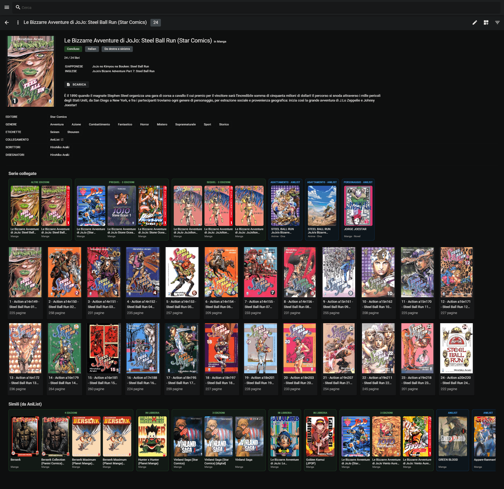
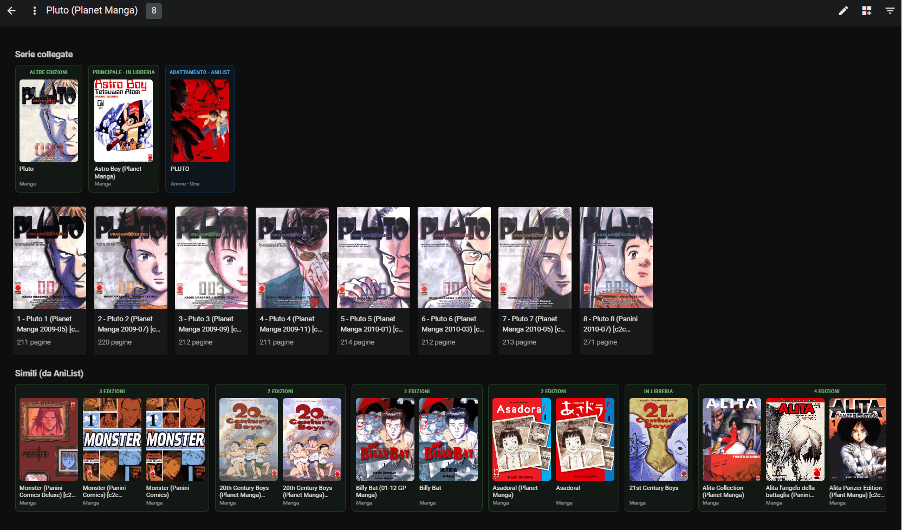
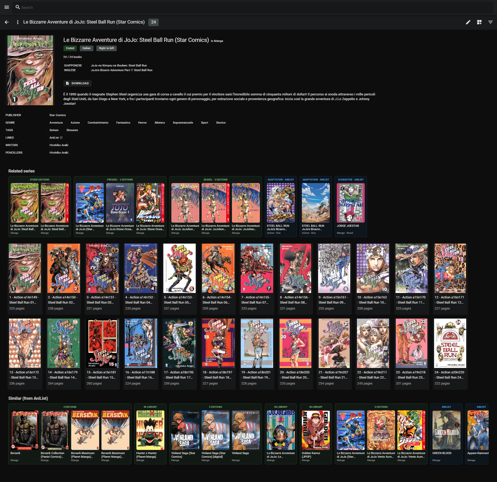
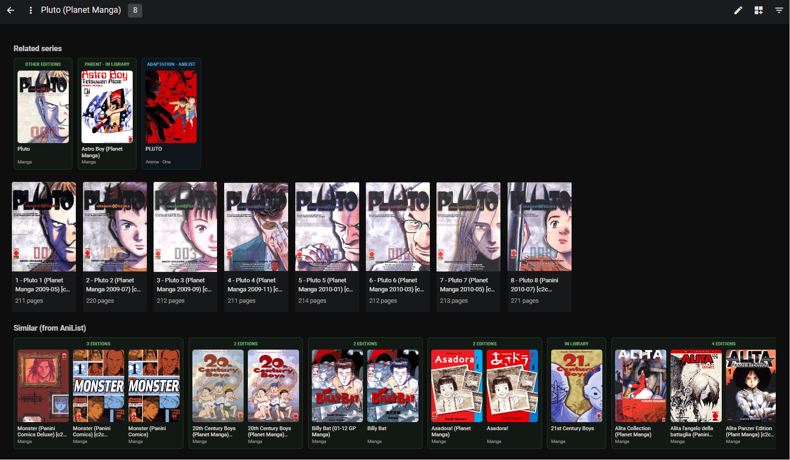

# Komga ⇄ AniList

*🇮🇹 [Italiano](#italiano) · 🇬🇧 [English](#english)*

---

## Italiano

Un piccolo reverse proxy che inietta uno script nella UI web di [Komga](https://komga.org) per mostrare
le **serie collegate** (sequel, prequel, side story…) e i **titoli simili** da
[AniList](https://anilist.co), direttamente in ogni pagina serie — senza forkare Komga e senza toccare
i tuoi metadati (italiani) esistenti.

Riusa il campo **Links** di Komga: ogni serie i cui link contengono un URL AniList ottiene una riga
*Serie collegate* sopra i volumi e una riga *Simili* in fondo. Le serie che già possiedi sono mostrate
con **titolo, copertina e link locali** di Komga (verde); il resto rimanda ad AniList (blu).

Screenshot

### Come funziona
- Un container `nginx` sta davanti a Komga e inietta `web/komga-anilist.js` nell'HTML (`sub_filter`).
- Lo script legge l'id AniList dai *Links* della serie, interroga la GraphQL di AniList (sola lettura)
  e disegna le sezioni.
- Le chiamate dal browser usano il **cookie di sessione** di Komga (stesso origin tramite il proxy):
  nessuna credenziale viene salvata da nessuna parte.

### Caratteristiche
- Relazioni (raggruppate per tipo) + raccomandazioni, **unite e deduplicate** anche per serie
  multi-volume / raccolte (una serie Komga → più id AniList).
- Le **altre edizioni** che possiedi della stessa opera compaiono per prime.
- Serie possedute → titolo/copertina/link **locali** di Komga; colore: verde = in libreria, blu = AniList.
- Segue la lingua di Komga (IT/EN), ritenta gli errori 5xx/429 di AniList, righe orizzontali con frecce.

### Setup
1. `cp .env.example .env` e imposta `KOMGA_UPSTREAM` con l'`host:porta` di Komga raggiungibile dal
   container (ed eventualmente `PROXY_PORT`).
2. `docker compose up -d`
3. Apri `http://<host>:<PROXY_PORT>` invece della porta diretta di Komga. (Se esponi Komga con un
   tunnel / reverse proxy, fai puntare quello al proxy.)
4. Aggiungi un link AniList a una serie in Komga (Modifica serie → Links → es. `https://anilist.co/manga/30002`)
   e ricarica la pagina della serie.

Per forzare la ricostruzione della mappa "libreria" dopo aver aggiunto link, apri la console del
browser e lancia `kalRefresh()`.

### Note
- Il frontend di Komga è una SPA Vue: un aggiornamento di Komga può cambiare i selettori CSS e
  richiedere piccoli aggiustamenti allo script.
- Funziona **solo sulla UI web** (browser). Le app native parlano direttamente con l'API e non sono coperte.
- AniList non ha proprio tutto (opere di nicchia, doujinshi, artbook, raccolte di saggi, edizioni
  solo-italiane…): in quei casi semplicemente non compare nessuna sezione.

---

## English

A tiny reverse proxy that injects a script into [Komga](https://komga.org)'s web UI to show
**related series** (sequels, prequels, side stories…) and **similar titles** from
[AniList](https://anilist.co), right on each series page — without forking Komga and without
touching your existing (localized) metadata.

It reuses Komga's built-in **Links** field: any series whose links contain an AniList URL gets a
*Related series* row above its volumes and a *Similar* row at the bottom. Series you already own are
shown with their **local Komga title, cover and link** (green); everything else links out to AniList (blue).

Screenshots

### How it works
- An `nginx` container sits in front of Komga and injects `web/komga-anilist.js` into the HTML (`sub_filter`).
- The script reads the AniList id from the series' *Links*, queries the AniList GraphQL API (read-only),
  and renders the sections.
- Browser requests use your Komga **session cookie** (same origin via the proxy), so no credentials are
  stored anywhere.

### Features
- Relations (grouped by type) + recommendations, **merged & de-duplicated**, including multi-volume /
  collection series (one Komga series → several AniList ids).
- **Other editions** you own of the same work are shown first.
- Owned series → **local** Komga title/cover/link; color-coded green = in library, blue = AniList.
- Follows Komga's UI language (IT/EN), retries AniList 5xx/429, horizontal rows with hover arrows.

### Setup
1. `cp .env.example .env` and set `KOMGA_UPSTREAM` to your Komga `host:port` (reachable from the
   container), and optionally `PROXY_PORT`.
2. `docker compose up -d`
3. Open `http://<host>:<PROXY_PORT>` instead of Komga's direct port. (If you expose Komga through a
   tunnel / reverse proxy, point that at this proxy.)
4. Add an AniList link to a series in Komga (Edit series → Links → e.g. `https://anilist.co/manga/30002`)
   and reload the series page.

To force a rebuild of the in-browser "owned" map after adding links, open the browser console and run
`kalRefresh()`.

### Notes
- Komga's frontend is a Vue SPA: a Komga update may change CSS selectors and require small tweaks to the script.
- Only affects the **web UI** (browsers). Native apps talk to the API directly and are not covered.
- AniList doesn't have everything (obscure works, doujinshi, artbooks, essay collections, region-only
  editions…); those simply show no section.

## License
[MIT](LICENSE)
